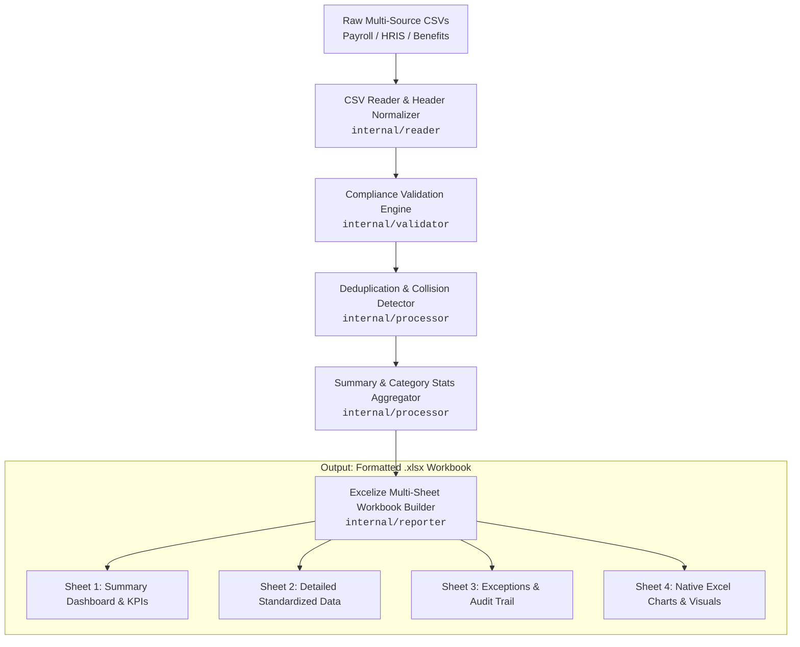

# 🏥 Compliance Data Quality & Excel Report Generator

[](https://golang.org)
[](https://www.irs.gov/affordable-care-act)
[-16A34A?logo=microsoftexcel)](https://github.com/xuri/excelize)
[](LICENSE)

A high-performance command-line data validation, compliance auditing, and multi-sheet Excel report generator built in **Go**. 

Engineered specifically for **Affordable Care Act (ACA)** reporting, employee benefits compliance, and payroll reconciliation. The engine ingests messy, heterogeneous CSV datasets, standardizes headers and data types, enforces IRS & SSA data validation rules, detects identity collisions and full-time equivalent (FTE) breaches, and outputs an audit-ready, 4-sheet formatted Excel workbook with automated charts.

---

## 🎯 The Core Problem & Interview Story

> *"In enterprise healthcare and ACA compliance reporting, raw data exported from client HRIS, payroll, and benefits systems is notoriously messy—containing inconsistent column headers, invalid or dummy SSNs, missing coverage offer codes, and part-time employees crossing full-time thresholds without logged offers.
>
> I built this compliance engine in **Go** to automate this end-to-end reconciliation pipeline: ingesting dirty CSV feeds, applying strict compliance validation rules, and generating an executive-ready, 4-sheet formatted Excel audit workbook complete with actionable exception queues and embedded charts."*

---

## 🏗️ System Architecture



---

## 📂 Project Structure

```
compliance-report-generator/
│
├── cmd/
│   └── report/
│       └── main.go                 # CLI entrypoint, flag parsing, console logging
│
├── internal/
│   ├── models/
│   │   ├── record.go               # EmployeeRecord, Exception data models
│   │   └── summary.go              # SummaryStats, DepartmentStat structs
│   ├── reader/
│   │   ├── csv_reader.go           # Robust CSV parser with flexible row handling
│   │   └── normalizer.go           # Fuzzy header mapping, SSN/date/currency sanitization
│   ├── validator/
│   │   ├── rules.go                # SSA SSN issuance rules, ACA Line 14/16 code sets
│   │   └── engine.go               # Multi-layer validation engine & exception generator
│   ├── processor/
│   │   ├── deduplicator.go         # Employee ID & SSN collision detection
│   │   └── stats.go                # Summary statistics, error rates, department metrics
│   └── reporter/
│       ├── excel.go                # Excelize orchestrator
│       ├── sheet_summary.go        # Sheet 1: Executive KPI cards & department tables
│       ├── sheet_details.go        # Sheet 2: Standardized records with custom styling
│       ├── sheet_exceptions.go     # Sheet 3: Actionable audit exceptions queue
│       └── sheet_charts.go         # Sheet 4: Native Excel doughnut, bar & column charts
│
├── testdata/
│   ├── sample_compliance_data.csv  # Realistic dataset with deliberate dirty records
│   └── clean_benchmark.csv         # Clean benchmark dataset
│
├── tests/
│   ├── reader_test.go              # Unit tests for reader & normalizer
│   ├── validator_test.go           # Unit tests for ACA rules & SSN checks
│   └── processor_test.go           # Unit tests for stats & deduplication
│
├── go.mod                          # Go module dependencies
├── go.sum                          # Checksums
└── README.md                       # Project documentation
```

---

## 🔍 Key Data Quality & Compliance Rules Enforced

| Rule Category | Validation Logic & Checks | Severity |
| :--- | :--- | :---: |
| **Identity & SSN** | Validates exact 9-digit format (`XXX-XX-XXXX`). Rejects SSA unissued ranges (e.g. area `000`, `666`, `900+`, group `00`, serial `0000`, dummy sequences `999-99-9999`). | `CRITICAL` |
| **Demographics** | Checks required Employee ID, First Name, Last Name. Normalizes dates (`YYYY-MM-DD`, `MM/DD/YYYY`, etc.) and flags dates preceding 1950 or >1 year future. | `CRITICAL` |
| **ACA Offer Codes (Line 14)** | Validates Form 1095-C Offer Codes against official IRS set: `1A` (Qualifying Offer), `1B` (Employee only), `1E` (Employee, spouse & dependents), `1H` (No offer), `1J`-`1U`. | `CRITICAL` |
| **ACA Safe Harbors (Line 16)** | Validates Section 4980H Safe Harbor and Relief codes: `2A` (Not employed), `2B` (Part-time), `2C` (Enrolled), `2D` (LNAP), `2F` (W-2), `2G` (FPL), `2H` (Rate of pay). | `WARNING` |
| **FTE Threshold Breach** | Identifies Part-Time / Variable-Hour employees who logged **$\ge$ 130 hours/month** (30 hrs/week), triggering mandatory ACA Look-Back review. | `WARNING` |
| **Affordability Bounds** | Validates employee monthly premium share against Federal Poverty Line (FPL) safe harbor caps for Code `1A` offers. Flags negative premiums/wages. | `CRITICAL` |
| **Cross-Record Collisions** | Tracks duplicate Employee IDs or duplicate SSNs across different employee names. | `CRITICAL` |

---

## 📊 Generated Excel Workbook Architecture

The generator builds an audit-ready `.xlsx` workbook using `excelize/v2`:

### **1. Sheet 1: Summary Dashboard**
* **Executive Metric Cards:** Total Records, Clean Records, Error Records, Missing Fields Count, Duplicate Count, Overall Error Rate (%), Potential FTEs ($\ge 130$ hrs), Average Monthly Hours.
* **Exceptions by Severity:** CRITICAL, WARNING, and INFO distribution.
* **Department Breakdown Table:** Department-level record counts, error rates, average hours, and health status indicators.

### **2. Sheet 2: Detailed Clean Data**
* Standardized, tabular representation of all employee records.
* Formatted currency values (`$#,##0.00`), normalized dates (`YYYY-MM-DD`), and visual status pills (`VALID` in green, `CRITICAL ERROR` in red).
* Auto-fitted column widths and custom Navy header styling.

### **3. Sheet 3: Exceptions & Remediation Queue**
* Granular audit trail for compliance officers and data analysts.
* Columns: `Exception #`, `Record ID`, `Employee ID`, `Employee Name`, `Field Name`, `Severity`, `Problem Description`, `Invalid / Detected Value`, `Suggested Action & Correction`.
* Color-coded severity badges for rapid triage.

### **4. Sheet 4: Visual Analytics & Charts**
* **Native Doughnut Chart:** Record Compliance Status (Clean vs Flagged).
* **Native Horizontal Bar Chart:** Data Quality Exceptions by Field.
* **Native Vertical Column Chart:** Error Rate (%) by Department.

---

## 🚀 Getting Started & CLI Usage

### Prerequisites
* [Go 1.21+](https://go.dev/dl/) installed.

### Installation & Build
```bash
git clone https://github.com/your-username/compliance-report-generator.git
cd compliance-report-generator

# Download dependencies
go mod tidy

# Run the tool directly
go run ./cmd/report/main.go --input testdata/sample_compliance_data.csv --output compliance_audit_report.xlsx
```

### CLI Options & Flags
```bash
Usage of report:
  --input string
        Path to input CSV file(s) or glob pattern (default "testdata/sample_compliance_data.csv")
  --output string
        Path for output Excel report (default "compliance_audit_report.xlsx")
  --verbose
        Enable verbose console summary logging (default true)
  --version
        Print version and exit
```

---

## 🧪 Running Automated Tests

Run the full unit test suite:
```bash
go test ./tests/... -v
```

Expected Output:
```
=== RUN   TestNormalizeHeader
--- PASS: TestNormalizeHeader (0.00s)
=== RUN   TestNormalizeSSN
--- PASS: TestNormalizeSSN (0.00s)
=== RUN   TestNormalizeDate
--- PASS: TestNormalizeDate (0.00s)
=== RUN   TestNormalizeCurrency
--- PASS: TestNormalizeCurrency (0.00s)
=== RUN   TestCSVReaderCleanFile
--- PASS: TestCSVReaderCleanFile (0.00s)
=== RUN   TestIsValidSSN
--- PASS: TestIsValidSSN (0.00s)
=== RUN   TestValidationEngine_CriticalErrors
--- PASS: TestValidationEngine_CriticalErrors (0.00s)
=== RUN   TestValidationEngine_FTEBreachWarning
--- PASS: TestValidationEngine_FTEBreachWarning (0.00s)
=== RUN   TestDeduplicator
--- PASS: TestDeduplicator (0.00s)
=== RUN   TestStatsProcessor
--- PASS: TestStatsProcessor (0.00s)
PASS
ok      compliance-report-generator/tests       0.045s
```

---

## 💡 Why Go for Compliance & Reporting Pipelines?

1. **Zero-Dependency Binary:** Compiles into a single standalone executable for deployment across Linux, Windows, or cloud serverless environments without requiring JVM or Python runtime installations.
2. **Predictable Performance & Memory Safety:** High-throughput streaming and struct allocations handle millions of payroll rows efficiently with sub-second execution times.
3. **Strong Type Safety:** Prevents silent runtime type coercions common in dynamic scripts, ensuring financial and regulatory calculations remain mathematically sound.
